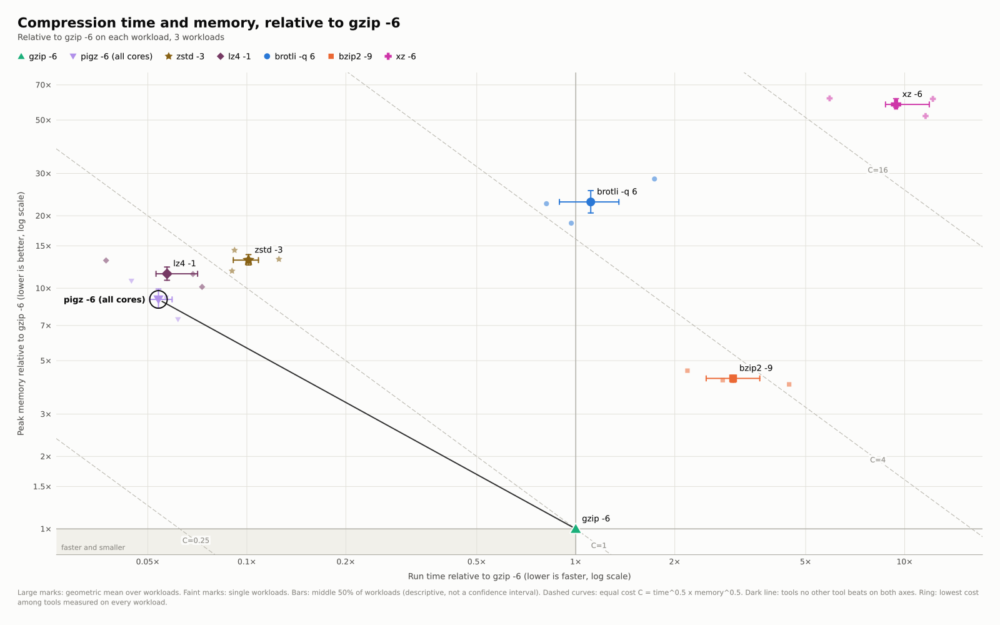

# isocost

[](https://github.com/eneskemalergin/isocost/actions/workflows/ci.yml) [](https://github.com/eneskemalergin/isocost/releases) [](LICENSE)

`isocost` reads [Zebrac](https://github.com/eneskemalergin/zebrac) benchmark results and draws how fast and how memory-hungry each tool is, relative to a reference tool. It writes figures (PNG, SVG, PDF), a Markdown report, and a JSON summary. It is one C program, about 180 KB, that needs only libc, libm, and POSIX threads. It runs on Linux.

The name comes from economics: an isocost line joins combinations of two inputs that cost the same. The dashed curves in the figure join combinations of run time and peak memory with the same combined cost.

Status: 0.1, the first public version. Options, config keys, and `summary.json` fields may still change before 1.0.



## Install

Download a static binary for x86-64 or AArch64 Linux from [Releases](https://github.com/eneskemalergin/isocost/releases):

```bash
version=0.1.0 arch=$(uname -m)
curl -fsSL https://github.com/eneskemalergin/isocost/releases/download/v$version/isocost-$version-$arch-linux.tar.gz | tar -xz
install -m 755 isocost-$version-$arch-linux/isocost ~/.local/bin/
```

[Getting started](https://github.com/eneskemalergin/isocost/wiki/Getting-Started) also checks the download against `SHA256SUMS`.

Or build it with a C17 compiler:

```bash
make                 # build/isocost
make test            # 43 checks, including AddressSanitizer and UBSan
make install         # copies it to ~/.local/bin (PREFIX=... to change)
make static          # build/isocost-static, a static binary like the releases (needs podman or docker)
```

## Use

Give it Zebrac JSON: one file, a directory tree, or a `bench.meta.v1` sidecar.

```bash
isocost report results/ -o report/   # figures, report.md, summary.json
isocost list results/                # what would be drawn and how each result was named
isocost config > isocost.toml        # every setting with its default
```

Each comparison gets two figures:

- `*-overview` places every tool by run time and peak memory relative to the reference. It shows the spread across workloads, the tools that no other tool beats on both axes, and curves of equal combined cost.
- `*-workloads` has one row per workload, so a tool that loses on one workload cannot hide behind its average.

Figures come in screen, slide, one-column (89 mm), and two-column (183 mm) sizes. PDF and SVG are vector files with the glyphs built in, so they look the same in every viewer.

## Configure

`isocost.toml` next to the results is optional. It names the tools, sets their colors, shapes, and labels, and chooses the reference, titles, sizes, and axis limits. For example:

```toml
[report]
baseline = "gzip -6"
formats = ["png", "pdf"]

[figure]
size = "paper"          # 89 mm wide at 300 dpi, 7 pt text

[[tool]]
id = "zstd -3"
match = "zstd -3 *"     # names every result whose command matches
color = "#2a78d6"
shape = "diamond"
```

## GitHub Action

Write a report in another repository's workflow, after Zebrac has written `results/`:

```yaml
- uses: eneskemalergin/isocost@v0.1.0
  with:
    results: results/
```

It adds the report to the job summary and uploads the figures as an artifact. [GitHub Action](https://github.com/eneskemalergin/isocost/wiki/GitHub-Action) lists every input.

## Documentation

The [wiki](https://github.com/eneskemalergin/isocost/wiki) is written in [wiki/](wiki/) and published on every push to `main`.

- [Getting started](https://github.com/eneskemalergin/isocost/wiki/Getting-Started): install, measure with Zebrac, and write a first report.
- [Configuration](https://github.com/eneskemalergin/isocost/wiki/Configuration): every setting.
- [Inputs](https://github.com/eneskemalergin/isocost/wiki/Inputs): which files are read, how results are named and grouped, and the exit status.
- [Reading the figures](https://github.com/eneskemalergin/isocost/wiki/Figures): what each mark means and the math behind it.
- [summary.json](https://github.com/eneskemalergin/isocost/wiki/Summary-JSON): the fields of `summary.json`.
- [examples/](examples/README.md): six real benchmarks with their configs.
- [Development](https://github.com/eneskemalergin/isocost/wiki/Development): source layout, tests, CI, and releases.

## Limits

isocost does not run benchmarks or sample processes. Zebrac measures; isocost reads what Zebrac wrote. Spreads show how tools vary across workloads. They are not confidence intervals, because Zebrac writes summaries, not paired samples.

## License

MIT, see [LICENSE](LICENSE). The built-in DejaVu Sans glyphs keep their own license, see [THIRD_PARTY_NOTICES.md](THIRD_PARTY_NOTICES.md).
