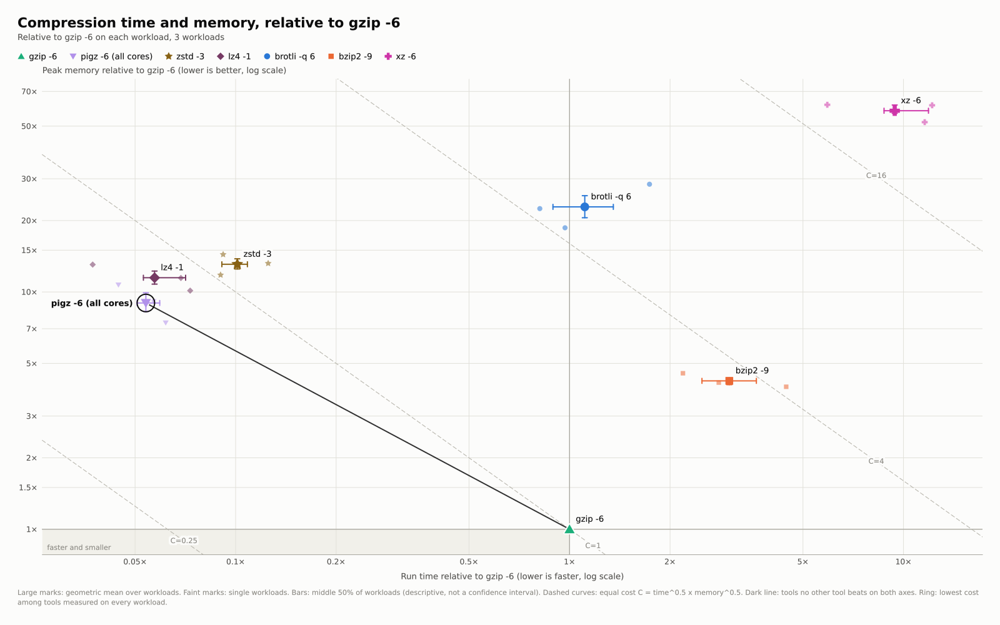

# Compression

Seven compressors at common levels, compressing and decompressing three 16 MiB inputs: C headers (a tar of `/usr/include`), executables (from `/usr/bin`), and sequencing reads (FASTQ). Each Zebrac run interleaves all seven commands round by round, so they share machine conditions.

```bash
build/isocost report examples/compression/results -o examples/compression/generated
```



Relative to `gzip -6`, `pigz -6` (all cores) compresses in 0.054x the time and is the only tool besides gzip that no other tool beats on both axes; `gzip -6` uses the least memory. For decompression, zstd is fastest (0.53x the time of `gzip -d`), and gzip, pigz, and zstd are all unbeaten on both axes.

`isocost.toml` shows the main configuration features: `[[tool]] match` names the results from their commands, `order` fixes the legend order, `[[group]]` sets a title and a reference per direction, and `[[workload]]` gives the inputs readable names.

## Measurement

- Machine: AMD Ryzen 9 3950X (16 cores, 32 threads), Linux 7.2.5, 2026-09-23.
- Tools: gzip 1.14, pigz 2.8, zstd 1.5.7, xz 5.8.2, bzip2 1.0.8, lz4 1.10.0, brotli 1.2.0.
- Zebrac 0.6.2: 2000 ms per command, at least 10 samples, 2 warmup runs.

Rerun with `examples/compression/bench.sh` (set `FASTQ=/path/to/reads.fastq` for the third input). Inputs are built under `data/`, which Git ignores.
